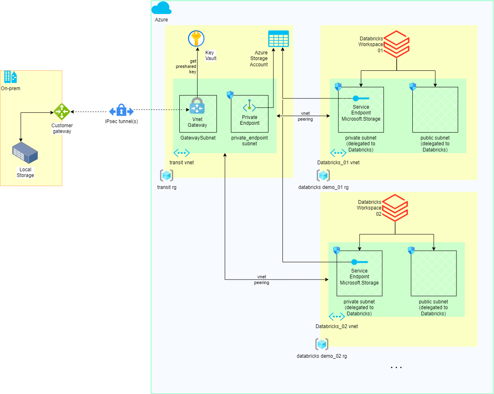

# Exercise: Azure Databricks deployment with on-premises connectivity

### Code structure
The taken approach of the Terraform code structure is a layered and a modularized one.
Layered deployment would mean that firstly the "base" infrastructure components, such as resource groups and virtual networks are deployed. The second layer would deploy storage, secrets, etc. The next layer deploys managed services, such as VMs, Kubernetes, etc.

Modularized deployment of the TF code has the following benefits:

1. reusability: the module can be called independently from other TF projects.
2. maintenance: the module can be versioned separately.
3. readability: fewer logically grouped lines.

### Exercise considerations
#### About the modules
Since this is an exercise, the TF modules are hosted in the same repository.

In an enterprise environment, we could host each module in its own repository. This would allow independent development, versioning and reusability. It would also split the infrastructure in several `.tfstate` files.

This approach is represented by the `depends_on = []` meta-argument for the sake of the exercise.

#### About the Tfstate
Also, the `.tfstate` file is saved locally on disk.

In a working environment, we would save the `.tfstate` in a remote backend. For example, on AWS S3 with DynamoDB for state locking.

#### About the .tfvars file
In a working environment, this file would usually be part of a separate repository and not part of the module's one.
Or it may not exist at all and the variables could be provided by an orchestrator such as Jenkins.

#### About scaling
The current implementation provides intial functionality. If we had to scale out, the modules would have to be adapted.

For example, the current implementation assumes one storage account for multiple Databricks workspaces.

### TF Modules
#### Network
Deploys the base network layer.

#### Transit connectivity
Deploys a transit virtual network for on-premises connectivity.

#### Transit virtual network peering
Peer a virtual network to the transit one.

#### Storage
Deploys a storage account and a container. Optionally deploys a Private Endpoint.

#### Databricks
Databricks workspace deployment with vnet injection.

### Usage

1. Checkout the git repository
2. Navigate to ./terraform
3. Execute
 - `terraform init` to initialize the terraform directory 
 - `terraform plan -out=demo.tfplan` to output a plan and save it to a file
 - `terraform apply demo.tfplan` to provision the infrastructure from the saved file
 - `terraform destroy` to destroy the infrastructure (with a prompt)

### TODO
- It would be nice to develop a tagging module with common infrastructure tags.
- Security & threat analysis.
- Scaling analysis: where could a bottleneck occur?
